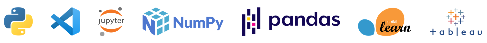

- 👋 Hi, I’m Alfian
- 🌱 I’m currently learning Data Analysis & Machine Learning

---
### My Project : 
Check my Portofolio Project Folder [**here**](https://github.com/FiguringThingsOut/DataSciencePortofolio)  

- [**Data Analysis - Northwind Traders**](https://github.com/FiguringThingsOut/DataSciencePortofolio/blob/main/DataAnalysis%20-%20NorthwindTraders/NorthwindTraders.ipynb)

  If the given link took a while or fail, please check out with nbviewer [**here**](https://nbviewer.org/github/FiguringThingsOut/DataSciencePortofolio/blob/a5c47f43d71c103851ba9ad5032eb0727e5d2812/DataAnalysis%20-%20NorthwindTraders/NorthwindTraders.ipynb)
  - SQL : Connect SQL to Python, Combine data from several tables, Instance of using CTE & window function (SQL)
  - Data exploration & data cleaning (check for missing values, duplicate data, wrong formatting, inconsistency typing, etc)
  - Data visualization & statistics
  - Resume : SQL, Visualization using TABLEAU & Python package (seaborn), hyphothesis testing, Insight from our graph

- [**Supervised Learning - Telco Customer Churn**](https://github.com/FiguringThingsOut/DataSciencePortofolio/blob/main/Supervised_ML_TelcoCustomerChurn/Supervised%20Learning%20-%20TELCO%20Customer%20Churn%20R1.ipynb)

  If the given link took a while or fail, please check out with nbviewer [**here**](https://nbviewer.org/github/FiguringThingsOut/DataSciencePortofolio/blob/a5c47f43d71c103851ba9ad5032eb0727e5d2812/Supervised_ML_TelcoCustomerChurn/Supervised%20Learning%20-%20TELCO%20Customer%20Churn%20R1.ipynb)
  - Data works : Check & clean our data, Exploring our data to find out why customer churn
  - Using supervised learning to predict churn customer :
    - Model selection, Hyperparameter tuning, Handling imbalance by using resampling method & adjust trehshold, Feature Importance, Conclussion, Recommendation
  - Deployment using Pickle
  - Resume : 
    - Algorithm : GradientBoost 
    - resampling method : SMOTENC
    - `Recall score` on CV : 82.33%, Score on Test Set @50% Threshold : 82.94%,  Score on Test Set @40% Threshold : 91.08%
    - 3 Most important features are : tenure, contract, InternetServices

- [**NLP - Text Processing - Olist Brazillian Ecommerce**](https://github.com/FiguringThingsOut/DataSciencePortofolio/blob/main/SentimentAnalysis%20-%20BrazillianEcommerce/P_Final_Project_AlphaTeam_SentimentAnalysis_R0.ipynb)

  If the given link took a while or fail, please check out with nbviewer [**here**](https://nbviewer.org/github/FiguringThingsOut/DataSciencePortofolio/blob/a5c47f43d71c103851ba9ad5032eb0727e5d2812/SentimentAnalysis%20-%20BrazillianEcommerce/P_Final_Project_AlphaTeam_SentimentAnalysis_R0.ipynb)
  - Data works : Import data, understanding data, join multiple table for EDA & machine learning, data cleaning.
  - Exploratory Data Analysis (this is an iterative process while studying the review comment message). Visualization using python package & TABLEAU Public
  - Text processing : 
    - Translating review comment message from Portugese to English
    - Converting emoji into text
    - Text preprocessing (lowercase, remove contraction, remove numbers, remove whitespace, remove stopwords, lemmatize)
    - Review Comment Message Analysis (n gram analysis up to 3 gram, text length analysis)
  - Using Supervised Learning to classify new review comment message whether it is positive sentiment or negative sentiment : 
    - Convert review comment message into features using TF - IDF
    - Model Selection, Hyperparameter Tuning
    - Feature Importance (words / features that describe positive or negative sentiments)
    - Implementation (defined function where you can input review comment message to determine whether it's positive or negative sentiment)
  - Resume : 
    - Algorithm : LogisticRegression 
    - `f1 score` on CV : 84.16%, Score on Test Set @50% Threshold : 84%
---

### Check me out on : 

---

### Language & Tools

<!---
FiguringThingsOut/FiguringThingsOut is a ✨ special ✨ repository because its `README.md` (this file) appears on your GitHub profile.
You can click the Preview link to take a look at your changes.
--->
